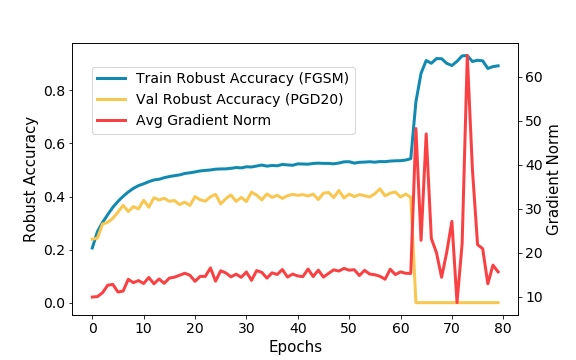

# Subspace Adversarial Training

**Tao Li, Yingwen Wu, Sizhe Chen, Kun Fang and Xiaolin Huang**

**CVPR2022**

## Abstract
      Single-step adversarial training (AT) has received wide attention as it proved to be both efficient and robust. However, a serious problem of catastrophic overfitting exists, i.e., the robust accuracy against projected gradient descent (PGD) attack suddenly drops to 0% during the training. In this paper, we approach this problem from a novel perspective of optimization and firstly reveal the close link between the fast-growing gradient of each sample and overfitting, which can also be applied to understand robust overfitting in multi-step AT. To control the growth of the gradient, we propose a new AT method, Subspace Adversarial Training (Sub-AT), which constrains AT in a carefully extracted subspace. It successfully resolves both kinds of overfitting and significantly boosts the robustness. In subspace, we also allow single-step AT with larger steps and larger radius, further improving the robustness performance. As a result, we achieve state-of-the-art single-step AT performance. Without any regularization term, our single-step AT can reach over 51% robust accuracy against strong PGD-50 attack of radius 8/255 on CIFAR-10, reaching a competitive performance against standard multi-step PGD-10 AT with huge computational advantages.



## Dependencies

Install required dependencies:

```
pip install -r requirements.txt
```

We also evaluate the robustness with [Auto-Attack](https://github.com/fra31/auto-attack). It can be installed via following source code:

```
pip install git+https://github.com/fra31/auto-attack
```


## How to run

We show sample usages in `run.sh`:

```
bash run.sh
```

For Tiny-ImageNet experiments, please prepare the dataset first under the path `datasets/tiny-imagenet-200/`. 

For more detailed settings of different datasets, please refer to the supplementary material.
